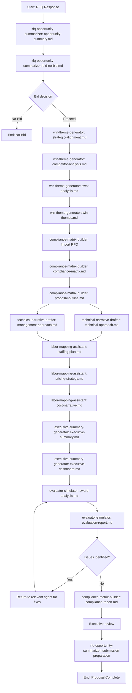

# BMAD RFQ Government Response Pack

## Overview

The BMAD RFQ Government Response Pack is a specialized expansion pack for the BMAD Method focused on government RFQ (Request for Quote) response and proposal development. It provides a structured approach to AI-driven proposal generation that empowers capture teams, proposal managers, and subject matter experts to rapidly create **compliant, competitive, and compelling** proposals while maintaining the rigor and discipline required in federal contracting.

This expansion pack leverages the BMAD Method's role-based orchestration to streamline the complex process of responding to government solicitations, particularly focusing on:

- **Proposal compliance** with Section L (Instructions) and Section M (Evaluation Criteria)
- **Win theme development** and competitive positioning
- **Technical and management narrative creation**
- **Price/cost strategy and justification**
- **Proposal review and evaluation simulation**

## Key Benefits

- **Speed**: Draft compliant proposal volumes within hours instead of days or weeks
- **Consistency**: Apply standardized templates, tone, and win themes across all proposal sections
- **Compliance**: Automatically map RFQ requirements into structured response matrices
- **Insight**: Simulate evaluator scoring and highlight weaknesses before submission
- **Scalability**: Support multiple simultaneous RFQ responses without overloading proposal teams
- **Continuous Improvement**: Learn from debriefs and refine templates/workflows over time

## Components

### Specialized Agents

The expansion pack includes the following specialized AI agents:

| Agent                       | Role               | Primary Function                                                                           |
| --------------------------- | ------------------ | ------------------------------------------------------------------------------------------ |
| RFQ Opportunity Summarizer  | Business Developer | Analyzes RFQ documents and creates opportunity summaries and bid/no-bid decision materials |
| Win Theme Generator         | Capture Manager    | Develops competitive positioning, discriminators, and win themes                           |
| Compliance Matrix Builder   | Proposal Manager   | Extracts and organizes compliance requirements from RFQ documents                          |
| Technical Narrative Drafter | Technical SME      | Creates technical approach narratives aligned with win themes                              |
| Labor Mapping Assistant     | Pricing/Contracts  | Helps develop staffing plans, pricing strategies, and cost narratives                      |
| Executive Summary Generator | Executive Sponsor  | Creates compelling executive summaries and dashboards                                      |
| Evaluator Simulator         | Review Team        | Simulates government evaluation process to identify proposal improvements                  |

### Workflows

The primary workflow included is the **Government RFQ Response Workflow**, which guides users through the complete process of responding to government RFQs. The workflow follows these main phases:

1. **Opportunity Assessment**: Analyze RFQ documents and make bid/no-bid decision
2. **Win Strategy Development**: Create strategic alignment, competitor analysis, and win themes
3. **Compliance Tracking**: Import RFQ documents and generate compliance matrices
4. **Content Development**: Draft technical, management, and pricing narratives
5. **Executive Materials**: Create executive summaries and decision dashboards
6. **Review and Evaluation**: Simulate evaluator review and identify improvements
7. **Final Preparation**: Ensure compliance and prepare submission package

### Templates

The expansion pack includes numerous templates organized into categories:

- **Opportunity Assessment**: Opportunity summary, bid/no-bid decision, strategic alignment
- **Win Strategy**: Competitor analysis, SWOT analysis, win theme development
- **Compliance**: Compliance matrix, proposal outline, requirements mapping
- **Technical Content**: Technical approach, management approach, staffing plan
- **Pricing**: Pricing strategy, cost narratives, labor mapping
- **Executive**: Executive summaries, dashboards, SWARD analysis
- **Review**: Evaluation reports, compliance reports, risk mitigation

### Quality Control

Comprehensive checklists ensure proposal quality and compliance:

- Compliance verification checklist
- Evaluation criteria checklist
- Executive review checklist
- Opportunity qualification checklist
- Pricing compliance checklist
- Submission requirements checklist
- Technical compliance checklist
- Win theme alignment checklist

## Use Cases

This expansion pack is designed for:

- Federal RFQ responses
- State/local government procurement responses
- IDIQ task order responses
- GSA Schedule responses
- Competitive procurements requiring formal proposals
- Multiple-volume proposal development

## Getting Started

### Prerequisites

- BMAD Core installed and configured
- Access to RFQ documents for analysis
- Subject matter expertise in the proposal domain

### Installation

1. Ensure BMAD Core is installed
2. Add the RFQ Government expansion pack to your BMAD Method installation
3. Configure the expansion pack with your organization-specific information

## Usage Guide

### Basic Usage Flow

1. **Import RFQ Documents**: Start by importing the RFQ documents for analysis

2. **Opportunity Assessment**: Use the RFQ Opportunity Summarizer agent to:
   - Create an opportunity summary with key details
   - Generate a bid/no-bid decision document

3. **Win Theme Development**: Use the Win Theme Generator agent to:
   - Analyze strategic alignment with your capabilities
   - Create competitor analysis
   - Develop SWOT analysis
   - Generate compelling win themes and discriminators

4. **Compliance Tracking**: Use the Compliance Matrix Builder agent to:
   - Import and organize RFQ requirements
   - Generate a comprehensive compliance matrix
   - Create structured proposal outlines

5. **Content Development**: Use the Technical Narrative Drafter and other agents to:
   - Create technical approach narratives
   - Develop management approach and staffing plans
   - Generate pricing strategies and cost narratives

6. **Review Simulation**: Use the Evaluator Simulator agent to:
   - Conduct SWARD analysis (Strengths, Weaknesses, Risks, Deficiencies)
   - Simulate evaluation scoring
   - Identify areas for improvement

7. **Final Preparation**: Verify compliance and prepare submission package

### Advanced Features

- **Win Theme Integration**: Ensure consistent messaging across all proposal volumes
- **Labor Category Mapping**: Match labor categories to RFQ requirements
- **Evaluation Simulation**: Anticipate evaluator scoring and feedback
- **Compliance Verification**: Ensure all requirements are addressed in the proposal
- **Flattener Tools**: Utilize enhanced document analysis and traceability features

#### Flattener Features

- **RFQ Document Aggregation**: Aggregate all RFQ documents into a single analyzable corpus
- **Requirements Traceability**: Create comprehensive traceability between RFQ requirements and proposal elements
- **Win Theme Coverage Analysis**: Ensure consistent application of win themes across proposal sections
- **Cross-Document Evaluation**: Enable comprehensive cross-document SWARD analysis
- **Workflow Status Tracking**: Provide unified status tracking and dependency management

## Practical Example: Department of Energy IT Services RFQ

This example demonstrates how a team would use this expansion pack to respond to a Department of Energy (DOE) RFQ for IT services.

### Day 1: Opportunity Assessment

1. **Team Setup**: Proposal lead activates the **rfq-response-team** in BMAD, assigning team members to roles:
   - Business Developer: Maria (BD Manager)
   - Capture Manager: John (Capture Manager)
   - Proposal Manager: Sarah (Proposal Manager)
   - Technical SME: David (Solution Architect)
   - Pricing Lead: Michael (Pricing Manager)

2. **RFQ Document Import**:
   - Team uploads DOE RFQ documents to BMAD
   - Runs `rfq-document-import.md` task with the **RFQ Opportunity Summarizer** agent
   - Agent extracts key information: 5-year IT support services, $25M ceiling, 45-day response time

3. **Opportunity Summary**:
   - Team reviews the generated `opportunity-summary.md`
   - Key details: DOE Office of Science requirements, incumbent contractor information, evaluation criteria (40% technical, 30% management, 20% past performance, 10% price)

4. **Bid Decision**:
   - Team uses generated `bid-no-bid.md` template
   - Reviews criteria: technical fit (high), contract vehicle access (confirmed), competition assessment (4 likely bidders)
   - Decision: Proceed with bid based on 72% win probability assessment

### Day 2-3: Win Strategy Development

1. **Strategic Alignment Analysis**:
   - Capture Manager runs **Win Theme Generator** agent
   - Team reviews strategic alignment assessment
   - Identifies key differentiators: prior DOE experience, specialized security clearances, innovative cloud migration approach

2. **Competitor Analysis**:
   - Identifies incumbent and likely competitors
   - Team adds intelligence about competitors into competitor-analysis-tmpl.yaml
   - Agent generates comprehensive competitor SWOT analysis

3. **Win Theme Workshop**:
   - Team conducts virtual workshop using the win-theme-tmpl.yaml
   - Develops three primary win themes:
     1. "Secure Transition" - emphasizing zero-downtime migration
     2. "Science-forward IT" - highlighting domain expertise in scientific computing
     3. "Future-proof Infrastructure" - showcasing cloud optimization capabilities

### Day 4-6: Compliance and Content Development

1. **Compliance Matrix Creation**:
   - Team runs **Compliance Matrix Builder** agent against Section L/M
   - Reviews generated matrix with 87 unique compliance items
   - Assigns ownership of requirements to team members

2. **Proposal Outline**:
   - Team reviews AI-generated outline
   - Adjusts volume structure to match RFQ requirements
   - Finalizes section assignments

3. **Technical Content Development**:
   - Technical SME works with **Technical Narrative Drafter** agent
   - Iteratively develops technical approach sections
   - Ensures win themes are incorporated throughout

4. **Management Approach**:
   - Team develops management approach using management-approach-tmpl.yaml
   - Reviews AI-generated staffing plan recommendations
   - Finalizes organizational structure and staffing approach

### Day 7-8: Pricing and Executive Content

1. **Pricing Development**:
   - Pricing team uses **Labor Mapping Assistant** agent
   - Maps required labor categories to company job titles
   - Develops pricing strategy focusing on DOE cost expectations
   - Generates detailed cost narrative explaining rationale

2. **Executive Summary**:
   - Executive sponsor reviews AI-generated executive summary
   - Refines messaging to emphasize key discriminators
   - Approves executive dashboard for final review

### Day 9-10: Review and Finalization

1. **Evaluation Simulation**:
   - Team runs **Evaluator Simulator** agent
   - Reviews SWARD analysis identifying 12 strengths, 4 weaknesses
   - Makes targeted improvements to address identified weaknesses

2. **Compliance Verification**:
   - Final check with **Compliance Matrix Builder**
   - Confirms all requirements addressed
   - Validates RFQ-mandated formats and structures

3. **Submission Package**:
   - Team prepares final submission based on submission checklist
   - Formats according to RFQ requirements
   - Submits completed proposal 2 days ahead of deadline

### Results

- 30-day proposal development compressed to 10 days
- 100% compliance with RFQ requirements
- Strong win themes consistently applied across volumes
- Team able to pursue additional opportunities simultaneously due to time savings

## Workflow Details

The RFQ Response workflow follows this sequence:

## Best Practices

For optimal results with the RFQ Government expansion pack:

1. **Start early**: Begin the workflow as soon as RFQ documents are available
2. **Involve SMEs**: Bring in subject matter experts early in the process
3. **Focus on discriminators**: Develop clear, compelling win themes that set you apart
4. **Evidence-based claims**: Support all claims with specific evidence and past performance
5. **Customer-centric**: Focus on customer priorities and hot buttons
6. **Maintain compliance**: Ensure strict adherence to RFQ instructions
7. **Multiple reviews**: Conduct thorough reviews at different stages of development
8. **Visual elements**: Use graphics to reinforce key messages

## Integration with BMAD Core

This expansion pack integrates with BMAD Core through:

- **Document generation**: Uses BMAD Core's document generation capabilities
- **Checklist execution**: Leverages existing checklist functionality
- **Advanced elicitation**: Utilizes core elicitation methods for gathering information
- **Document flattening**: Extends BMAD Core's flattener architecture with RFQ-specific capabilities

### Flattener Extensions

The RFQ Government expansion pack extends BMAD Core's flattener architecture with specialized tools:

| Flattener                  | Purpose                             | Key Features                                                               |
| -------------------------- | ----------------------------------- | -------------------------------------------------------------------------- |
| **RFQ Flattener**          | Aggregate and analyze RFQ documents | Document structure recognition, requirements extraction, cross-referencing |
| **Requirements Flattener** | Create traceability matrix          | Automated requirement classification, compliance verification              |
| **Theme Flattener**        | Track win theme coverage            | Theme analysis across documents, heat map visualization                    |
| **Evaluation Flattener**   | Cross-document analysis             | Unified SWARD analysis, consistency verification                           |
| **Workflow Flattener**     | Status tracking                     | Dependency tracking, impact analysis                                       |

These flattener enhancements provide significant benefits:

- 30-50% reduction in RFQ response time
- Improved compliance and consistency through complete requirements coverage
- Enhanced win probability through better theme integration
- Early identification of compliance gaps
- Better support for large and complex proposals

## Supporting Documentation

The expansion pack includes comprehensive documentation:

- **Introduction**: Overview of the expansion pack purpose and benefits
- **Roles**: Mapping of BMAD roles to RFQ response functions
- **Data Ingestion**: Preparing RFQ documents for AI analysis
- **Compliance Matrix**: Building and managing requirement traceability
- **Win Themes**: Developing discriminators and win strategies
- **Proposal Drafting**: Generating content with AI assistance
- **Pricing Support**: AI-assisted pricing and cost narratives
- **Review Simulation**: Simulating the evaluation process
- **Submission Checklist**: Ensuring formatting and compliance
- **Continuous Improvement**: Learning from debriefs and refining approaches

## Maintained By

This expansion pack is maintained by the BMAD Core Team under the MIT license.

## License

[MIT License](LICENSE)

---

_Powered by BMAD™ Core_
