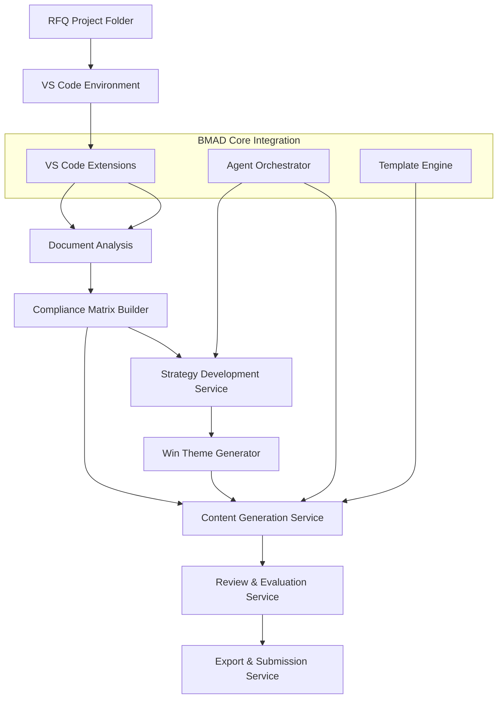

# System Overview

The BMAD RFQ Government Expansion Pack is designed as a modular extension to the BMAD Method core system, providing specialized capabilities for government RFQ proposal development. The architecture follows a service-oriented approach with clear separation of concerns and integration points with the core BMAD infrastructure.

## High-Level Architecture

