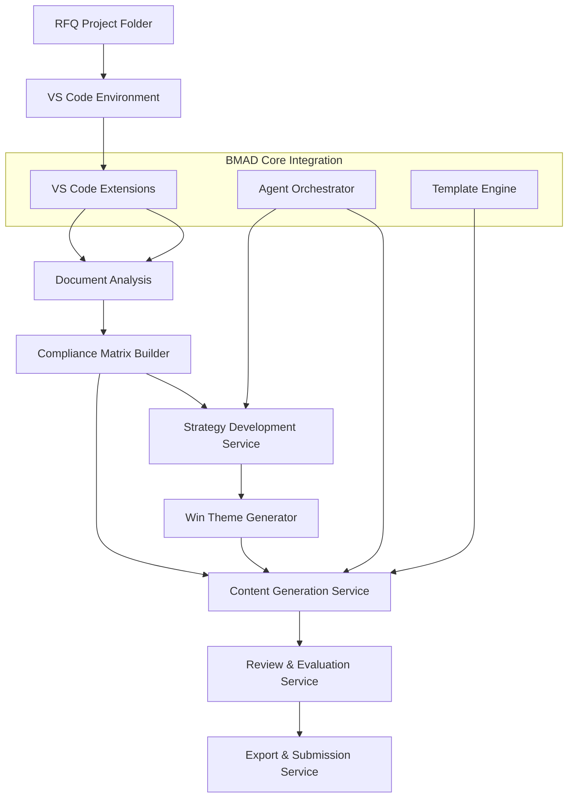

# BMAD RFQ Government Expansion Pack Architecture

## System Overview

The BMAD RFQ Government Expansion Pack is designed as a modular extension to the BMAD Method core system, providing specialized capabilities for government RFQ proposal development. The architecture follows a service-oriented approach with clear separation of concerns and integration points with the core BMAD infrastructure.

## High-Level Architecture



## Core Components

### 1. Document Access Layer

- **Project Folder Structure**
  - Organized folder hierarchy for RFQ documents
  - VS Code workspace configuration
  - Document access guidelines
  - Access control through file system permissions

- **VS Code Extension Integration**
  - Integration with Roo Code, Cline, and Claude
  - Document reading capabilities
  - Context-aware analysis
  - AI-assisted requirement identification

### 2. Compliance Management Layer

- **Compliance Matrix Builder**
  - Automated requirement mapping
  - Section cross-referencing
  - Traceability matrix generation
  - Export capabilities (DOCX, Excel)

- **Strategic Compliance Planner**
  - Proposal organization optimizer
  - Requirement grouping logic
  - Coverage visualization
  - Emphasis recommendation engine

### 3. Strategy Development Layer

- **Section M Analyzer**
  - Evaluation criteria extraction
  - Scoring methodology analysis
  - Success factor identification
  - Priority weighting system

- **Win Theme Generator**
  - Theme development engine
  - Capability mapping system
  - Customer alignment analyzer
  - Theme prioritization matrix

### 4. Content Generation Layer

- **Template Management System**
  - Section-specific templates
  - Dynamic content blocks
  - Formatting rules engine
  - Template customization interface

- **Narrative Generation Service**
  - Technical approach generator
  - Management approach generator
  - Past performance formatter
  - Executive summary generator

### 5. Review & Quality Control Layer

- **Evaluation Simulator**
  - Section M criteria matcher
  - Scoring prediction engine
  - Gap analysis system
  - Improvement recommendation engine

- **Quality Control System**
  - Consistency checker
  - Compliance validator
  - Format verification
  - Graphics/tables validator

## Integration Architecture

### BMAD Core Integration Points

1. **Agent Orchestration**
   - Proposal Manager Agent
   - Technical SME Agent
   - Compliance Manager Agent
   - Review Agent
   - Quality Control Agent

2. **Template Engine Integration**
   - Template inheritance system
   - Custom template definitions
   - Dynamic template generation
   - Template validation hooks

3. **VS Code Extension Integration**
   - Document reading capabilities
   - AI-assisted analysis
   - Context preservation
   - Extension configuration

## Data Architecture

### Storage Components

1. **Project Folder Structure**
   - Organized file system for RFQ documents
   - Standard folder naming conventions
   - Version control through Git
   - Access control through file permissions

2. **Requirements Database**
   - Structured requirement storage
   - Relationship mapping
   - Status tracking
   - Change history

3. **Template Repository**
   - Template version control
   - Template metadata
   - Usage analytics
   - Customization history

### Security Architecture

1. **Access Control**
   - Role-based access control (RBAC)
   - Document-level permissions
   - Encryption at rest
   - Encryption in transit

2. **Audit System**
   - Activity logging
   - Change tracking
   - Access monitoring
   - Compliance reporting

## Workflow Architecture

### Proposal Development Workflow

1. **RFQ Analysis Phase**

   ```mermaid
   graph LR
       Organize[Organize RFQ in Project] --> Access[Access via VS Code]
       Access --> Analyze[AI Extension Analysis]
       Analyze --> Extract[Extract Requirements]
       Extract --> Plan[Strategic Planning]
   ```

2. **Content Development Phase**

   ```mermaid
   graph LR
       Requirements[Requirements] --> Templates[Select Templates]
       Templates --> Generate[Generate Content]
       Generate --> Review[Internal Review]
       Review --> Refine[Refine Content]
   ```

3. **Review & Submission Phase**
   ```mermaid
   graph LR
       Draft[Draft Content] --> Evaluate[Evaluate]
       Evaluate --> QC[Quality Control]
       QC --> Format[Format Check]
       Format --> Package[Package for Submission]
   ```

## Technical Specifications

### Performance Requirements

- Document access: Immediate through VS Code extensions
- Requirement identification accuracy: Based on VS Code extension capabilities
- Content generation response time: < 30 seconds per section
- Concurrent proposal support: Based on VS Code workspace limitations

### Scalability Considerations

- Project folder organization for multiple proposals
- Local caching through VS Code
- Extension-based content generation
- File system-based document storage

### Monitoring & Logging

- Performance metrics tracking
- Error rate monitoring
- Usage analytics
- System health checks

## Implementation Guidelines

### Development Standards

- Follow BMAD expansion pack conventions
- Leverage VS Code extension capabilities
- Use standard file system organization
- Maintain comprehensive documentation

### Deployment Requirements

- Compatible with VS Code environment
- Local workspace setup
- Extension configuration
- Project template distribution

## Future Considerations

### Extensibility Points

- Additional VS Code extension integration
- Enhanced document analysis capabilities
- Custom extension development
- Template system expansion

### Planned Enhancements

- Multi-workspace collaboration
- Extension-based analytics
- AI-assisted graphics suggestions
- Enhanced folder security
